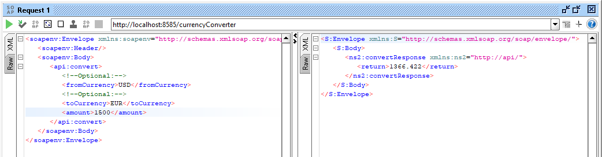

# SOAP-Currency-Converter

This repository contains a SOAP-based Currency Converter API implemented in Java. The API allows you to convert currency amounts between different currencies using real-time exchange rates.

## Testing the Service

To test the service, you can use SOAPUI, a popular tool for testing SOAP-based web services. Follow the steps below to set up the SOAPUI project and make requests to the Currency Converter API.

1. Download and install SOAPUI from the official website: [https://www.soapui.org/downloads/soapui/](https://www.soapui.org/downloads/soapui/)

2. Launch SOAPUI and create a new project.

3. Set the project name and choose the appropriate workspace directory.

4. Click on "Create" to create the new project.

5. Right-click on the project and select "Add WSDL."

6. Enter the WSDL URL for the Currency Converter API: `http://localhost:8585/currencyConverter?wsdl`

7. SOAPUI will fetch the WSDL and generate the service and its operations.

8. Expand the CurrencyConverterService node in the project tree to view the available operations.

9. To test the `convert` operation, right-click on it and select "Add to Request 1."

10. Fill in the input parameters:
    - `fromCurrency`: The currency code to convert from (e.g., USD)
    - `toCurrency`: The currency code to convert to (e.g., EUR)
    - `amount`: The amount to convert

11. Click on the green play button to send the request to the Currency Converter API.

12. SOAPUI will display the response, which includes the converted amount and the exchange rate used.

## Features

### Transaction Logging

Every currency conversion request made to the API is logged as a transaction. Each transaction includes the timestamp, source currency, target currency, amount, exchange rate, and converted amount. The transactions are logged using the Transaction class. You can find the implementation details in the `util/Transaction.java` file.

### Caching

The Currency Converter API includes a caching mechanism to improve performance. The cache stores previously fetched exchange rates to avoid making redundant API calls. The cache implementation is available in the `CurrencyConverterCache` class. Cached exchange rates are stored for a duration of 5 minutes by default. You can find the implementation details in the `util/CurrencyConverterCache.java` file.

## Deployment

To deploy the web service, you can run the `CurrencyConverterServer` class. It will publish the web service endpoint at `http://localhost:8585/currencyConverter`.

## Dependencies

The following dependencies are used in this project:

- [Jakarta XML Web Services API](https://mvnrepository.com/artifact/jakarta.xml.ws/jakarta.xml.ws-api)
- [JSON](https://mvnrepository.com/artifact/org.json/json)

Please make sure to include these dependencies in your project's classpath.

## Additional Information

The Currency Converter API is implemented using Java and the Jakarta Web Services (JAX-WS) framework. It makes use of the ExchangeRate-API to fetch the latest exchange rates. The API also includes a simple cache mechanism to store recently used exchange rates for improved performance.

Feel free to explore the source code and make any modifications or enhancements as needed.

If you encounter any issues or have any questions, please open an issue in the repository or contact the project maintainer.

Happy currency conversion!
